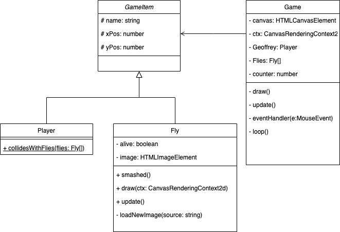

# Smash the fly

It is a very simple assignment. Given is the start code for `smashing the fly` in folder 'start'. Implement the following class diagram using the code from the start folder.

In the end folder a solution is provided.

## Class diagram

The constructor and the getters and setters are not in the UML diagram. You have to add them yourself to the code.

